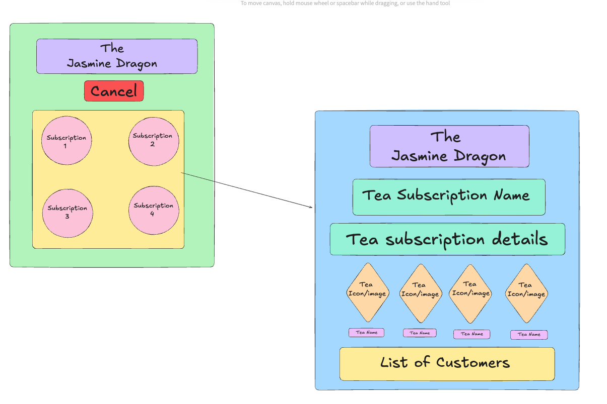

# The Jasmine Dragon - FE

## Overview

This is the front-end React application for The Jasmine Dragon, a tea subscription management tool designed for staff members. It consumes data from a custom-built Rails API and provides a simple, intuitive UI for viewing and managing customer subscriptions. Check out my frontend repo [here!](https://github.com/ldsauer/vite-react-starter)

### Notable Technologies

- React
- Vite
- Router
- CSS

## Running Locally

### Requirements

- Ruby `3.2.2`
- bundler gem: `gem install bundler`
- [Postgres](https://www.postgresql.org/download/)

### Setup Steps

1. Clone the repo to your machine: `git clone git@github.com:ldsauer/vite-react-starter.git`
2. Open the directory: `cd vite-react-starter`
3. Install dependecies: `npm install`
4. Setup the dev server: `npm run dev`

## Wireframe 



## Component Architecture

```
src/components
├── App
│   ├── App.css
│   └── App.jsx
├── SubscriptionCard
│   ├── SubscriptionCard.css
│   └── SubscriptionCard.jsx
├── SubscriptionDetails
│   ├── SubscriptionDetails.css
│   └── SubscriptionDetails.jsx
└── SubscriptionsList
    ├── SubscriptionsList.css
    └── SubscriptionsList.jsx
```

## Contributors

### Logan Sauer

- [LinkedIn](https://www.linkedin.com/in/ldsauer/)
- [GitHub](https://github.com/ldsauer)
